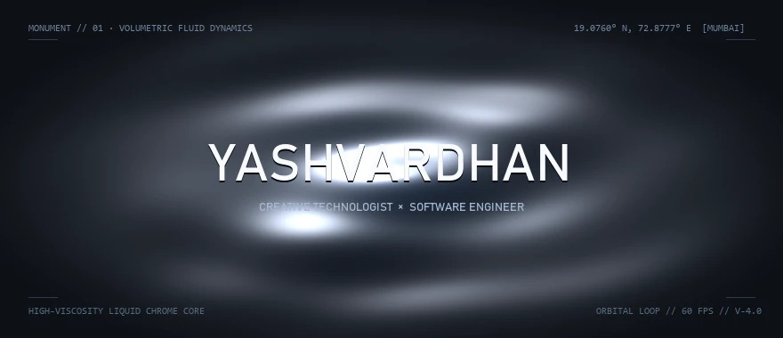
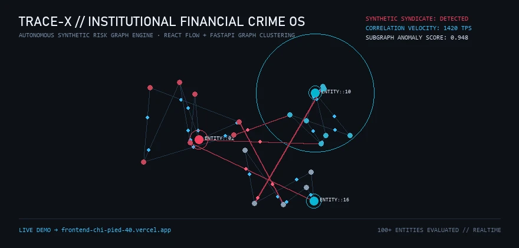
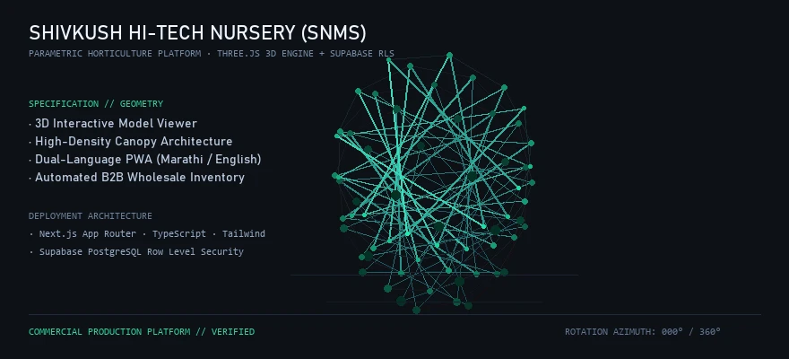
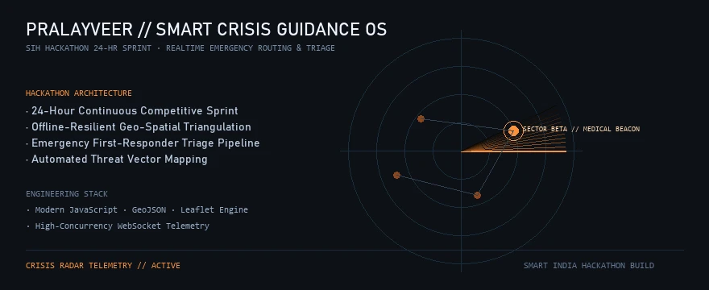
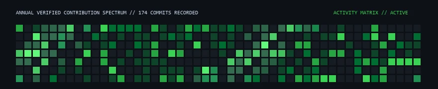

<div align="center">



</div>

<br />

```
IDENTITY        Yashvardhan Borude
ROLE            Creative Technologist × Software Engineer
FOCUS           Interactive Graphics · Graph Intelligence · Spatial Web Systems
LOCATION        Mumbai, Maharashtra, India  [19.0760° N, 72.8777° E]
STATUS          Building & Researching Production Software
```

---

### PROLOGUE

I build software where technical rigor meets visual craft. My work bridges reactive frontend architectures, spatial 3D interfaces, and high-velocity data systems—treating the browser as an instrument for real-time computing and visceral interaction.

---

### SELECTED WORKS

<br />

#### 01 // TRACE-X · INSTITUTIONAL FINANCIAL CRIME OS

<div align="center">
  <a href="https://frontend-chi-pied-40.vercel.app" target="_blank">
    
  </a>
</div>

```
STACK           TypeScript · Next.js · React Flow · FastAPI · Network Clustering
DEPLOYMENT      Production Live on Vercel
REPOSITORY      github.com/Yashvardhan-4/TRACE-X
DEMO            frontend-chi-pied-40.vercel.app
```

An institutional intelligence operating system designed for anti-financial crime units and forensic investigators. Detects synthetic identity rings, transaction smurfing, and insider risk across complex financial networks using interactive force-directed graph clustering and sub-second anomaly scoring.

* **Graph Intelligence:** Interactive canvas rendering dense financial subgraphs with real-time risk clustering.
* **Forensic Analytics:** Automated identification of circular transaction paths and multi-hop entity hops.
* **Architecture:** Decoupled FastAPI analytical backend powering a reactive Next.js presentation tier.

<br />

---

#### 02 // SHIVKUSH HI-TECH NURSERY (SNMS)

<div align="center">
  <a href="https://github.com/Yashvardhan-4/SNMS" target="_blank">
    
  </a>
</div>

```
STACK           Next.js App Router · Three.js · Supabase PostgreSQL · Tailwind CSS
SECURITY        Row Level Security (RLS) · Dual-Language Marathi / English PWA
REPOSITORY      github.com/Yashvardhan-4/SNMS
```

Commercial-grade horticulture management system and client-facing digital platform engineered for high-volume contract farming and wholesale agricultural commerce.

* **Spatial 3D Specimen Viewer:** Integrated Three.js model viewport allowing clients to inspect plant structural morphology and canopy density prior to contract reservation.
* **Dual-Language PWA:** Bilingual interface built in Marathi and English with offline-first local state persistence for rural agricultural operators.
* **Enterprise Security:** Multi-tenant Supabase PostgreSQL architecture protected by strict Row Level Security policies.

<br />

---

#### 03 // PRALAYVEER · SMART CRISIS GUIDANCE OS

<div align="center">
  <a href="https://github.com/Yashvardhan-4/PralayVeer" target="_blank">
    
  </a>
</div>

```
EVENT           Smart India Hackathon (SIH) · 24-Hour Continuous Engineering Sprint
STACK           Modern JavaScript · Leaflet Geospatial Engine · GeoJSON Pipeline
REPOSITORY      github.com/Yashvardhan-4/PralayVeer
```

Emergency crisis management and citizen evacuation guidance system engineered during a 24-hour hackathon sprint. Designed for zero-connectivity disaster zones, providing real-time threat vector mapping and offline geospatial triangulation for first responders.

<br />

---

### TECHNICAL ARSENAL

Organized by engineering discipline and active technical application:

```
SPATIAL & INTERACTIVE     WebGL · Three.js · GLSL Shaders · React Flow · Kinetic Physics
FRONTEND ARCHITECTURE     TypeScript · Next.js (App Router) · React 19 · Tailwind CSS
SYSTEMS & BACKEND         Python · FastAPI · Node.js · Supabase PostgreSQL (RLS) · REST
TOOLS & WORKFLOWS         Git · Docker · Linux · Postman · Chrome DevTools Profiling
```

---

### VERIFIED ACTIVITY

<div align="center">
  
</div>

```
METRIC          174 Verified Annual Contributions
REGISTRY        Public Open Source & Core Infrastructure Commits
CADENCE         Continuous Building & Rapid Prototyping
```

---

### CONNECT

```
DIRECT          yashvardhanborude7@gmail.com
GITHUB          github.com/Yashvardhan-4
LINKEDIN        linkedin.com/in/yashvardhan-borude
```

<div align="center">
<sub>Engineered with precision & craft · Mumbai, India</sub>
</div>
