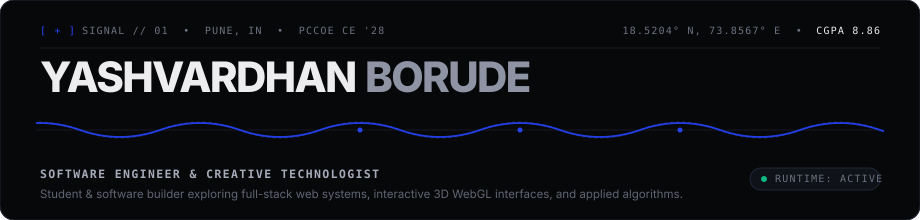
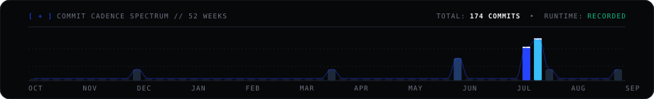

<div align="center">

<!-- MOVEMENT 01: MONOLITH HERO -->
<a href="https://linkedin.com/in/yashvardhan-borude-8640a6319/">
  
</a>

</div>

<p align="center">
  
</p>

<!-- MOVEMENT 02: SPECTRUM / CORE FOCUS -->
### / 01 &#160;·&#160; SPECTRUM

<table>
  <tr>
    <td width="28%"><code>01 // SPATIAL &amp; WEBGL</code></td>
    <td width="72%">Interactive 3D scenes with Three.js, HTML5 Canvas particle simulations, and responsive browser interfaces.</td>
  </tr>
  <tr>
    <td><code>02 // FULL-STACK SYSTEMS</code></td>
    <td>Relational schema design, Supabase PostgreSQL with Row-Level Security (RLS), and RESTful API architecture.</td>
  </tr>
  <tr>
    <td><code>03 // ALGORITHMIC LOGIC</code></td>
    <td>Graph algorithms, network shortest paths, dynamic programming, and computational problem solving.</td>
  </tr>
  <tr>
    <td><code>04 // APPLIED DATA &amp; ML</code></td>
    <td>Data extraction, exploratory analysis, and predictive modeling using Python, Pandas, and Scikit-Learn.</td>
  </tr>
</table>

<p align="center">
  
</p>

<!-- MOVEMENT 03: SELECTED WORK (HONEST & GROUNDED) -->
### / 02 &#160;·&#160; SELECTED WORK

#### [ + ] 01 — SHIVKUSH NURSERY MANAGEMENT SYSTEM (SNMS)
> **Stack:** `Three.js` &bull; `Supabase` &bull; `PostgreSQL (RLS)` &bull; `Vanilla JS` &bull; `PWA`  
> **Type:** Commercial Client Contract &bull; Ahilyanagar, Maharashtra

A full-stack web application built for a commercial nursery client. Developed a bilingual (English / Marathi) mobile-first interface with an interactive 3D WebGL plant model viewer (Three.js) and Canvas particle effects. Backed by Supabase PostgreSQL with Row-Level Security policies to manage live stock levels, booking workflows, and WhatsApp-integrated customer orders.

<br>

#### [ + ] 02 — PRALAYVEER / DISASTER AWARENESS PLATFORM
> **Stack:** `JavaScript (ES6+)` &bull; `Accessible Web Standards` &bull; `Git Collaboration`  
> **Type:** Smart India Hackathon (SIH 2024) &bull; 24-Hour MVP

A rapid-response crisis awareness web platform built under a 24-hour hackathon timeline. Prioritized zero-latency client rendering, WCAG accessibility standards, and low-bandwidth resilience to ensure emergency instructions remain usable for non-technical citizens during crisis scenarios.

<br>

#### [ + ] 03 — STARTUP VALUATION PREDICTOR
> **Stack:** `Python 3` &bull; `Scikit-Learn` &bull; `Pandas` &bull; `Matplotlib`  
> **Type:** Applied Machine Learning Project

A regression pipeline trained on historical venture capital financing datasets. Engineered feature sets across investment stages, sector velocity, and capital raised to predict startup valuation trajectories and visualize distribution patterns.

<p align="center">
  
</p>

<!-- MOVEMENT 04: CUSTOM GITHUB-DATA ARTWORK & SUBSTRATE -->
### / 03 &#160;·&#160; ACTIVITY CADENCE &amp; SUBSTRATE

<div align="center">
  
</div>

<br>

```text
CORE TOOLS      C++20  ·  Python 3  ·  JavaScript (ES6+)  ·  SQL (PostgreSQL)
SURFACE         Three.js  ·  WebGL  ·  Canvas API  ·  Tailwind CSS  ·  PWA
DATA & CLOUD    PostgreSQL (RLS)  ·  Supabase  ·  MongoDB  ·  Scikit-Learn  ·  Pandas
FOUNDATIONS     Data Structures & Algorithms  ·  Graph Theory  ·  Linux  ·  Git
```

<p align="center">
  
</p>

<!-- MOVEMENT 05: TRANSMISSION & INDEX -->
<div align="center">

```text
─────────────────────────────────────────────────────────────────────────────
END OF RECORD // YB-2026 // PUNE, INDIA
DISPATCH → yashvardhanborude7@gmail.com
─────────────────────────────────────────────────────────────────────────────
```

<p align="center">
  <a href="https://github.com/Yashvardhan-4"><b>GitHub</b></a> &#160;&bull;&#160;
  <a href="https://linkedin.com/in/yashvardhan-borude-8640a6319/"><b>LinkedIn</b></a> &#160;&bull;&#160;
  <a href="https://leetcode.com/u/yashvardhan_4/"><b>LeetCode</b></a> &#160;&bull;&#160;
  <a href="https://codeforces.com/profile/yashvardhanborude7"><b>Codeforces</b></a> &#160;&bull;&#160;
  <a href="https://www.codechef.com/users/cheer_swan_02"><b>CodeChef</b></a> &#160;&bull;&#160;
  <a href="./NewResume.pdf"><b>Curriculum Vitae [PDF]</b></a>
</p>

<br>

<sub>Designed with editorial restraint &#160;&bull;&#160; Deep Obsidian <code>#07080A</code> &#160;&bull;&#160; Klein Cobalt <code>#2544FF</code></sub>

</div>
