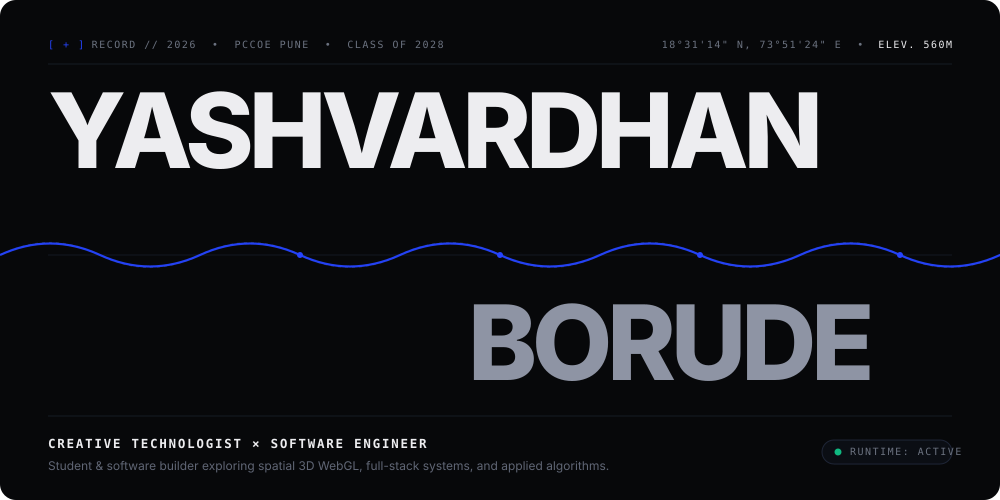
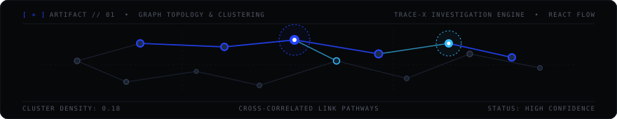
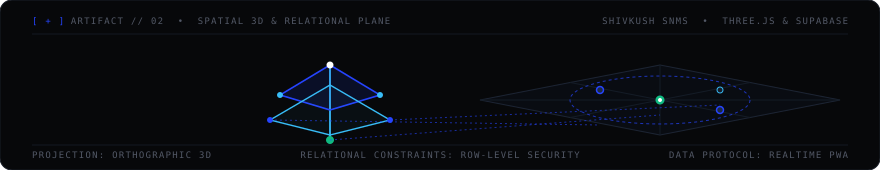
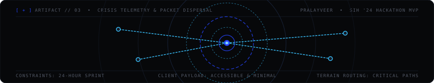

<div align="center">

<!-- MOVEMENT 01: POSTER-SCALE MONOLITH HERO -->
<a href="https://linkedin.com/in/yashvardhan-borude-8640a6319/">
  
</a>

</div>

<br><br><br>

<!-- MOVEMENT 02: THE VOID & MANIFESTO -->
<div align="center">

<sub>[ + ] MANIFESTO // 01</sub>

# Building at the intersection of creative technology,<br>interactive spatial systems, and computational logic.

<sub>PUNE, INDIA &#160;•&#160; PCCOE COMPUTER ENGINEERING &#160;•&#160; CLASS OF 2028</sub>

</div>

<br><br><br>

<p align="center">
  
</p>

<!-- MOVEMENT 03: SELECTED EXHIBITS -->

### / 01 &#160;·&#160; SELECTED EXHIBITS

#### [ + ] EXHIBIT 01 — TRACE-X
> **Medium:** `TypeScript` &bull; `Next.js` &bull; `React Flow` &bull; `FastAPI` &bull; `Graph Analytics`  
> **Source:** [github.com/Yashvardhan-4/TRACE-X](https://github.com/Yashvardhan-4/TRACE-X) &bull; [Live System ↗](https://frontend-chi-pied-40.vercel.app)

An institutional investigation system for correlated financial crime and insider risk analysis. Engineered with high-density interactive graph topologies via React Flow, automated counterfactual pathways, and forensic link exploration.

<div align="center">
  
</div>

<br><br>

#### [ + ] EXHIBIT 02 — SHIVKUSH NURSERY MANAGEMENT SYSTEM (SNMS)
> **Medium:** `Three.js` &bull; `Supabase` &bull; `PostgreSQL (RLS)` &bull; `Vanilla JS` &bull; `PWA`  
> **Domain:** Commercial Client Contract &bull; Ahilyanagar, Maharashtra

A full-stack commerce and operations platform built for a commercial nursery client. Features a bilingual (English / Marathi) mobile interface, an interactive 3D WebGL plant viewer, and Supabase PostgreSQL with Row-Level Security policies for live inventory and order workflows.

<div align="center">
  
</div>

<br><br>

#### [ + ] EXHIBIT 03 — PRALAYVEER
> **Medium:** `JavaScript (ES6+)` &bull; `Accessible Web Architecture` &bull; `SIH '24 MVP`  
> **Source:** [github.com/Yashvardhan-4/PralayVeer](https://github.com/Yashvardhan-4/PralayVeer)

A rapid-response emergency guidance web platform built under a 24-hour hackathon timeline during Smart India Hackathon (SIH 2024). Focused on accessible frontend architecture, fast load times, and low-bandwidth resilience for citizens in crisis zones.

<div align="center">
  
</div>

<br><br><br>

<p align="center">
  
</p>

<!-- MOVEMENT 04: THE FREQUENCY PULSE -->

### / 02 &#160;·&#160; ACTIVITY FREQUENCY SPECTRUM

<div align="center">
  
</div>

<br><br><br>

<p align="center">
  
</p>

<!-- MOVEMENT 05: THE SUBSTRATE (TYPOGRAPHIC CONSTELLATION) -->

### / 03 &#160;·&#160; SUBSTRATE &amp; ATOMS

<div align="center">

```text
C++20                     TYPESCRIPT             PYTHON 3

               THREE.JS               WEBGL

POSTGRESQL (RLS)              SUPABASE                REACT FLOW

               GRAPH THEORY           FASTAPI
```

</div>

<br><br><br>

<p align="center">
  
</p>

<!-- MOVEMENT 06: TRANSMISSION -->

<div align="center">

```text
─────────────────────────────────────────────────────────────────────────────
END OF RECORD // YB-2026 // PUNE, INDIA
DISPATCH → yashvardhanborude7@gmail.com
─────────────────────────────────────────────────────────────────────────────
```

<p align="center">
  <a href="https://github.com/Yashvardhan-4"><b>GitHub</b></a> &#160;&bull;&#160;
  <a href="https://linkedin.com/in/yashvardhan-borude-8640a6319/"><b>LinkedIn</b></a> &#160;&bull;&#160;
  <a href="https://leetcode.com/u/yashvardhan_4/"><b>LeetCode</b></a> &#160;&bull;&#160;
  <a href="https://codeforces.com/profile/yashvardhanborude7"><b>Codeforces</b></a> &#160;&bull;&#160;
  <a href="https://www.codechef.com/users/cheer_swan_02"><b>CodeChef</b></a> &#160;&bull;&#160;
  <a href="./NewResume.pdf"><b>Curriculum Vitae [PDF]</b></a>
</p>

<br>

<sub>Designed with editorial restraint &#160;&bull;&#160; Deep Obsidian <code>#07080A</code> &#160;&bull;&#160; Klein Cobalt <code>#2544FF</code></sub>

</div>
