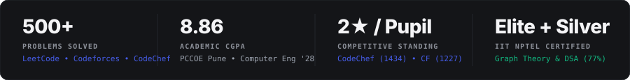

<!-- HERO BANNER -->

 

<!-- EDITORIAL NAVIGATION / VERIFIED PROFILES -->

  <a href="https://linkedin.com/in/yashvardhan-borude-8640a6319/"><b>LinkedIn</b></a> &nbsp;•&nbsp;
  <a href="https://leetcode.com/u/yashvardhan_4/"><b>LeetCode</b></a> &nbsp;•&nbsp;
  <a href="https://codeforces.com/profile/yashvardhanborude7"><b>Codeforces</b></a> &nbsp;•&nbsp;
  <a href="https://www.codechef.com/users/cheer_swan_02"><b>CodeChef</b></a> &nbsp;•&nbsp;
  <a href="https://www.hackerrank.com/profile/yashvardhanboru9"><b>HackerRank</b></a> &nbsp;•&nbsp;
  <a href="./NewResume.pdf"><b>Curriculum Vitae</b></a>

 

<!-- PROOF-OF-WORK METRIC LEDGER -->

 

---

### Executive Profile

Third-year Computer Engineering undergraduate (**Batch of 2028, CGPA: 8.86**) at **Pimpri Chinchwad College of Engineering (PCCOE), Pune**. Combines competitive programming rigor with hands-on production engineering, having architected, built, and shipped real-world web infrastructure for paying commercial clients. 

Focused on **scalable system design, distributed data integrity, modern 3D WebGL interfaces, and algorithmic problem solving**.

 

---

### Featured Production Engineering

#### `01` Shivkush Hi-Tech Nursery — Full-Stack E-Commerce Infrastructure
> **Role:** Contracted Full-Stack Software Developer &bull; *December 2025 – Present*  
> **Core Stack:** `Supabase (PostgreSQL)` &bull; `Three.js` &bull; `WebGL` &bull; `Canvas API` &bull; `PWA & ServiceWorkers`

* **High-Performance Spatial Frontend:** Architected a bilingual (English / Marathi) mobile-first interface featuring dynamic dark mode, interactive 3D WebGL product displays via Three.js, and high-framerate particle simulations via the Canvas API.
* **Secure Commerce & Relational Engine:** Engineered a complete shopping cart and real-time order lifecycle backend utilizing Supabase with strict **Row-Level Security (RLS)** policies, custom database constraints, and transactional order management.
* **Operations Command Dashboard:** Built an administrative interface with full CRUD workflows, live stock tracking, financial analytics, and a dynamic CMS for live announcements.
* **Offline-First PWA:** Integrated ServiceWorker caching protocols for instant load times, 1-tap WhatsApp ordering, automated SEO metadata, and app installation capabilities for rural users.

 

#### `02` PralayVeer — Rapid-Response Disaster Preparedness Architecture
> **Role:** Frontend Systems Lead &bull; *Smart India Hackathon (SIH) — August 2024*  
> **Core Stack:** `Vanilla JS (ES6+)` &bull; `Accessible Web Standards` &bull; `Collaborative Git Workflow`

* Delivered a fully functional emergency awareness and disaster response MVP under strict 24-hour hackathon competition constraints.
* Enforced WCAG accessibility and low-bandwidth optimizations to guarantee real-time usability for non-technical users facing urgent crisis scenarios.

 

#### `03` Startup Valuation Predictor — Machine Learning Pipeline
> **Role:** ML & Data Engineer &bull; *October 2024*  
> **Core Stack:** `Python` &bull; `Scikit-Learn` &bull; `Pandas` &bull; `Matplotlib`

* Developed a predictive regression pipeline estimating private market startup valuations across varying sector verticals.
* Cleaned and engineered feature sets from historical multi-stage venture financing rounds, generating sector growth velocity metrics and ecosystem visualizations.

 

---

### Technical Architecture & Systems Taxonomy

<table>
  <tr>
    <td width="25%" valign="top"><b>Languages &amp; Core</b></td>
    <td width="75%">
      <code>C++20</code> &bull; <code>JavaScript (ES6+)</code> &bull; <code>Python 3</code> &bull; <code>SQL / PostgreSQL</code> &bull; <code>HTML5 &amp; CSS3</code>
    </td>
  </tr>
  <tr>
    <td width="25%" valign="top"><b>Frontend &amp; Spatial</b></td>
    <td width="75%">
      <code>Three.js</code> &bull; <code>WebGL</code> &bull; <code>HTML5 Canvas API</code> &bull; <code>Tailwind CSS</code> &bull; <code>Progressive Web Apps (PWA)</code> &bull; <code>Responsive Design</code>
    </td>
  </tr>
  <tr>
    <td width="25%" valign="top"><b>Backend &amp; Cloud</b></td>
    <td width="75%">
      <code>Supabase</code> &bull; <code>PostgreSQL (RLS &amp; Indexing)</code> &bull; <code>Node.js</code> &bull; <code>MongoDB</code> &bull; <code>REST APIs</code> &bull; <code>Service Workers</code>
    </td>
  </tr>
  <tr>
    <td width="25%" valign="top"><b>Algorithms &amp; Methods</b></td>
    <td width="75%">
      <code>Graph Theory</code> &bull; <code>Dynamic Programming</code> &bull; <code>Greedy Paradigms</code> &bull; <code>Object-Oriented Design (OOD)</code> &bull; <code>System Architecture</code>
    </td>
  </tr>
  <tr>
    <td width="25%" valign="top"><b>Tooling &amp; Data</b></td>
    <td width="75%">
      <code>Git &amp; GitHub</code> &bull; <code>Linux / Bash</code> &bull; <code>Scikit-Learn</code> &bull; <code>Pandas</code> &bull; <code>Figma (UI/UX Design Systems)</code>
    </td>
  </tr>
</table>

 

---

### Verified Algorithmic Milestones

* **IIT NPTEL Silver Medalist:** Ranked in the top bracket with **77/100 (Elite + Silver)** in *"Algorithmic Graph Theory and Data Structures"* — an intensive 12-week IIT curriculum covering maximum flow networks, shortest path topologies, and NP-completeness.
* **Competitive Problem Solving:** 500+ verified solutions across algorithmic platforms:
  * **CodeChef:** 2-Star Competitor *(Peak Rating: 1434)*
  * **Codeforces:** Pupil *(Peak Rating: 1227, 200+ problems solved)*
  * **HackerRank:** 5-Star Competitor *(C++)*
  * **LeetCode:** 213+ algorithmic challenges solved in graph theory, DP, and greedy heuristics.

 

---

### Activity & Repository Telemetry

  
  

  

  <picture>
    <source media="(prefers-color-scheme: dark)" srcset="https://raw.githubusercontent.com/Yashvardhan-4/Yashvardhan-4/output/github-contribution-grid-snake-dark.svg">
    <source media="(prefers-color-scheme: light)" srcset="https://raw.githubusercontent.com/Yashvardhan-4/Yashvardhan-4/output/github-contribution-grid-snake.svg">
    
  </picture>

 

---

### Direct Communications & Inquiries

  <b>Yashvardhan Shashikant Borude</b> 
  Pune, Maharashtra, India &nbsp;&bull;&nbsp; 
  <a href="mailto:yashvardhanborude7@gmail.com">yashvardhanborude7@gmail.com</a> &nbsp;&bull;&nbsp; 
  +91-7058230773

  
  
  
  
  

 

Designed with editorial rigor &bull; Monochromatic obsidian palette `#0C0D0E` with Dennis Snellenberg cobalt `#455CE9`

