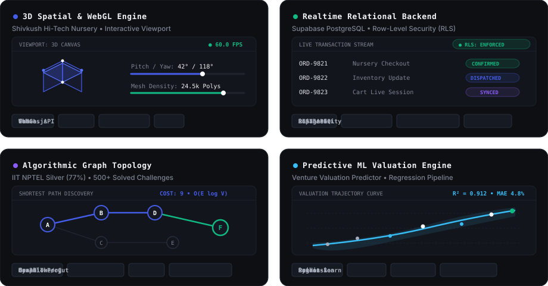

<!-- HERO & COMMAND BAR -->

  

<!-- PROOF-OF-WORK METRIC LEDGER -->

  

<!-- FLAGSHIP UI BENTO SHOWCASE (VISUAL UI CONCEPTS) -->

 

---

### Featured Production Architecture

<table>
  <tr>
    <td width="33%" valign="top">
      <h4><code>01</code> Shivkush Hi-Tech Nursery</h4>
      
<b>Commercial E-Commerce Platform</b> 
      Dec 2025 – Present &bull; Client Contract

      
Bilingual (EN/MR) mobile-first PWA featuring real-time Supabase PostgreSQL with Row-Level Security (RLS), interactive Three.js 3D WebGL product displays, Canvas API particle animations, and 1-tap WhatsApp CRM ordering.

      <code>Supabase</code> &bull; <code>Three.js</code> &bull; <code>WebGL</code> &bull; <code>PostgreSQL RLS</code> &bull; <code>PWA</code>
    </td>
    <td width="33%" valign="top">
      <h4><code>02</code> PralayVeer</h4>
      
<b>Disaster Awareness System</b> 
      Smart India Hackathon (SIH) 2024

      
Lead frontend architecture for a rapid-response emergency preparedness platform delivered within a high-pressure 24-hour hackathon timeline, enforcing strict WCAG accessibility for non-technical users.

      <code>Vanilla JS</code> &bull; <code>Accessible UI</code> &bull; <code>Collaborative Git</code> &bull; <code>MVP</code>
    </td>
    <td width="33%" valign="top">
      <h4><code>03</code> Valuation Predictor</h4>
      
<b>Machine Learning Pipeline</b> 
      Oct 2024 &bull; Venture Analytics

      
Predictive regression model estimating venture startup valuations utilizing historical multi-stage financing telemetry, sector growth velocity indices, and automated feature engineering pipelines.

      <code>Python</code> &bull; <code>Scikit-Learn</code> &bull; <code>Pandas</code> &bull; <code>Data Visualization</code>
    </td>
  </tr>
</table>

 

---

### Technical Architecture & Systems Taxonomy

  <b>Systems &amp; Algorithms</b> 
  
  
  
  
  

  <b>Spatial &amp; Modern Web</b> 
  
  
  
  
  
  

  <b>Databases, Cloud &amp; Intelligence</b> 
  
  
  
  
  
  

 

---

### Activity & Repository Telemetry

  
  

  

  <picture>
    <source media="(prefers-color-scheme: dark)" srcset="https://raw.githubusercontent.com/Yashvardhan-4/Yashvardhan-4/output/github-contribution-grid-snake-dark.svg">
    <source media="(prefers-color-scheme: light)" srcset="https://raw.githubusercontent.com/Yashvardhan-4/Yashvardhan-4/output/github-contribution-grid-snake.svg">
    
  </picture>

 

---

### Direct Communications & Verified Profiles

  <b>Yashvardhan Shashikant Borude</b> 
  Pune, Maharashtra, India &nbsp;&bull;&nbsp; 
  <a href="mailto:yashvardhanborude7@gmail.com">yashvardhanborude7@gmail.com</a> &nbsp;&bull;&nbsp; 
  +91-7058230773

  
  
  
  
  
  

 

Crafted with high-precision UI engineering &bull; Clean obsidian palette `#0D0F12` with Royal Cobalt `#455CE9`

